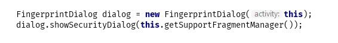
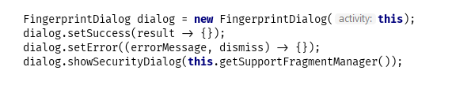

# SecurityManager
A Library to help you protect your applications.

## Simple to use
#### • This is the first way to use the FingerprintDialog:

#### • If you want to control the return you can use: 

#### How to install it via Gradle:
[Click here](https://jitpack.io/#Wottrich/security-manager)
